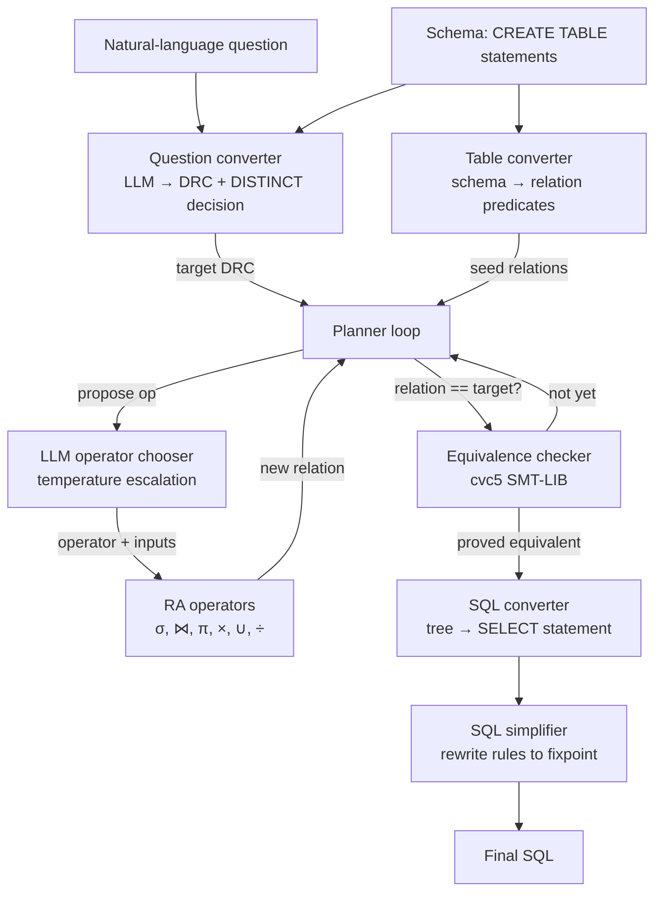

# Text-to-SQL Planner

A natural-language-to-SQL system that produces SQL whose meaning is *formally
verified* against the user's intent — not just plausible-looking SQL stitched
together by a language model.

The pipeline:

1. An LLM converts the question into Domain Relational Calculus (DRC), a
   first-order set-builder language with relations as predicates.
2. A symbolic planner builds the answer as a sequence of relational-algebra
   operators applied to the schema's tables.
3. After every step, an SMT solver (cvc5) is asked to *prove* that the
   relation built so far is logically equivalent to the target DRC. The
   planner iterates until cvc5 returns `unsat` for "the two could differ".
4. The proven operation tree is lowered to SQL.

The result is SQL that is provably equivalent to a formal specification of
the question, not just empirically similar.

## Goals

- **Correctness first.** Every step is checked by an SMT solver; the SQL we
  emit is the SQL whose DRC the planner *proved* equivalent to the target.
  No "looks right to a benchmark" — `unsat` or nothing.
- **Auditable.** Every artifact is human-readable: the DRC (Lisp + Unicode
  pretty form), the operation tree, the SMT-LIB script, the SQL, and the
  simplified SQL. Verbose mode prints them all.
- **Schema-aware but agnostic.** No fine-tuning, no schema embeddings — only
  the CREATE TABLE statements you provide. Works on schemas the model has
  never seen.
- **Composable extensions.** The core formalism is set-based DRC. Non-set
  features (LIMIT, ORDER BY) are layered on top as explicit
  non-relational wrappers so they don't pollute the core semantics or
  the equivalence check.

## Quick start

```bash
# 1. cvc5 (SMT solver — needed at runtime)
curl -L -o /tmp/cvc5.zip \
  https://github.com/cvc5/cvc5/releases/download/cvc5-1.3.4/cvc5-Linux-x86_64-static.zip
unzip -o /tmp/cvc5.zip -d /tmp/cvc5-extract
sudo install -m755 /tmp/cvc5-extract/cvc5-Linux-*/bin/cvc5 /usr/local/bin/cvc5
cvc5 --version

# 2. Python deps (uv recommended; pip works too)
uv sync     # or: pip install -e ".[dev]"

# 3. AWS credentials with Bedrock access for the Claude model
#    (Anthropic API key is NOT used; we go through Bedrock.)
aws configure          # or env vars / SSO / instance role

# 4. Run an example
uv run python -m text_to_sql_planner \
  -q "Show me the top 5 most-compensated employees" \
  -f example_schema.sql \
  -v
```

## Requirements

- Python 3.11+ (uses `tomllib`, `asyncio.TaskGroup`, etc.)
- `cvc5` on `PATH` (any 1.x release; tested with 1.3.4)
- AWS credentials with `bedrock:InvokeModel` for `global.anthropic.claude-opus-4-6-v1`

The Python dependencies are pinned in `pyproject.toml`:

| Runtime    | Dev                |
|------------|--------------------|
| `boto3`    | `pytest`           |
| `pydantic` | `pytest-asyncio`   |
|            | `hypothesis`       |

## Usage

### CLI

```bash
uv run python -m text_to_sql_planner [-q QUESTION] [-s SCHEMA | -f SCHEMA_FILE] [...]
```

| Flag             | Purpose                                         |
|------------------|-------------------------------------------------|
| `-q, --question` | The natural-language question (else read stdin) |
| `-s, --schema`   | Inline `CREATE TABLE` statements                |
| `-f, --schema-file` | Path to a file with `CREATE TABLE` statements |
| `-v, --verbose`  | Show DRC, operation tree, SMT scripts           |
| `-o, --output`   | Write Markdown report to file (else stdout)     |
| `--region`       | AWS region (default `us-east-1`)                |
| `--model-id`     | Bedrock model ID                                |
| `--max-iterations` | Planner iteration cap (default 50)            |
| `--max-retries`  | Retries per iteration (default 5)               |
| `--cvc5-path`    | Path to `cvc5` binary (default `cvc5`)          |
| `--cvc5-timeout` | Per-check timeout in seconds (default 30)       |

Exit codes: `0` on success, `1` on any failure.

### Python API

```python
import asyncio
from text_to_sql_planner import run
from text_to_sql_planner.main import TextToSQLSuccess

schema = """\
CREATE TABLE Employees (emp_id INT, name VARCHAR, salary DECIMAL);
"""

async def main():
    result = await run(
        question="Show me the top 5 most-compensated employees",
        schema=schema,
    )
    if isinstance(result, TextToSQLSuccess):
        print(result.sql)
    else:
        print(f"[{result.code.value}] {result.error}")

asyncio.run(main())
```

`run()` accepts an optional `config: PlannerConfig` to tune model, region,
iteration caps, temperature schedule, and cvc5 timeout.

### Examples folder

`examples/example0.py` … `example3.py` are end-to-end runs against the
included `example_schema.sql`. Use them as smoke tests:

```bash
uv run python examples/example3.py
```

### Tests

```bash
uv run pytest tests/ -q          # 275 tests, no external services needed
uv run pytest tests/unit -v      # unit suite only
```

LLM and cvc5 calls are mocked; the suite runs offline.

## Architecture

### High-level pipeline



### What runs where

| Stage              | Module                                                       | What it does                                                              |
|--------------------|--------------------------------------------------------------|---------------------------------------------------------------------------|
| Tokenize / parse   | `parser/lexer.py`, `parser/parser.py`                        | Lisp S-expr → DRC AST. `parse_query` accepts `(limit … (order-by … (drc …)))` wrappers. |
| Print              | `printer/lisp_printer.py`, `printer/pretty_printer.py`       | DRC AST → Lisp form (machine-friendly) and Unicode form (`{x \| ∃y …}`).  |
| Schema → relations | `converter/table_converter.py`                               | Each table becomes a predicate `T(a, b, c)`.                              |
| Question → DRC     | `converter/question_converter.py`, `planner/llm_client.py`   | Bedrock Claude emits Lisp DRC; we re-prompt on parse error.               |
| RA operators       | `operators/{selection,join,projection,cartesian_product,union,division}.py` | Each operator is a pure function `(params, inputs) → DRC`. |
| Planner loop       | `planner/planner.py`                                         | LLM picks next op + inputs; we apply, check equivalence, escalate temp on retries. |
| Equivalence        | `equivalence/{smt_converter,equivalence_checker}.py`         | DRC → SMT-LIB; parallel cvc5 (one for `unsat`, one for `sat`); first decisive answer wins. |
| SQL emit           | `sql/sql_converter.py`                                       | Operation tree → flat SELECT, with `DISTINCT` / `ORDER BY` / `LIMIT` driven by the extended-DRC wrappers. |
| SQL simplify       | `sql/simplifier.py`                                          | Rule-based rewrites (unwrap subqueries, inline rebindings, `CROSS JOIN`+`WHERE`→`JOIN ON`, …). |

### Extended DRC

Core DRC is set-based: `{x1, …, xn | φ}`. To represent ordering and
size-bounded queries we layer non-relational wrappers *outside* the set:

```text
QueryExpression ::= LIMIT(N, QueryExpression)
                  | ORDER_BY([(criterion, dir), ...], QueryExpression)
                  | DRCExpression       -- core, set-based
```

In Lisp:

```lisp
(limit 5 (order-by ((salary desc)) (drc (emp_id name salary)
                                        (in (emp_id name salary) Employees))))
```

The wrappers don't change the planner or the SMT layer — equivalence is
checked on the *core* DRC. The wrappers are appended to the outer SELECT
during SQL emission. This keeps the formalism honest: the things SMT can
prove (set-membership) stay in the set-based layer; the things it can't
(row order, row counts) live above it.

### What "verified" means here

For the target DRC `T = {x | φ_T(x)}` and the planner-built relation
`R = {x | φ_R(x)}`, we ask cvc5 to decide:

```text
(set-logic ALL)
(declare-fun ... ; relations as uninterpreted Bool functions
(declare-const ... ; free vars used in φ_R or φ_T)
(assert (not (forall (x1 ... xn) (= φ_R φ_T))))
(check-sat)
```

`unsat` ⇒ no input makes them differ ⇒ the relations are equivalent over
*every* possible interpretation of the schema's predicates, not just one
specific database state. `sat` ⇒ cvc5 found a counter-example. `timeout`
or `unknown` is treated as not-equivalent and the planner keeps searching.

The planner short-circuits an obvious mismatch (different result-variable
arity) without invoking cvc5.

### Repository layout

```
text_to_sql_planner/
├── __init__.py
├── main.py                       # run(): full pipeline
├── cli.py                        # argparse + Markdown report
├── types/
│   ├── drc.py                    # core DRC AST + LIMIT/ORDER_BY wrappers
│   ├── operators.py              # RA operator parameter types
│   ├── operation_tree.py         # planner's proven-correct tree shape
│   └── errors.py
├── parser/
│   ├── lexer.py
│   └── parser.py                 # parse() and parse_query()
├── printer/
│   ├── lisp_printer.py           # print_lisp(), print_query_lisp()
│   └── pretty_printer.py         # pretty_print(), pretty_print_query()
├── converter/
│   ├── table_converter.py
│   └── question_converter.py     # LLM-driven, with retry-on-parse-error
├── operators/
│   ├── selection.py
│   ├── join.py
│   ├── projection.py
│   ├── cartesian_product.py
│   ├── union.py
│   └── division.py
├── equivalence/
│   ├── smt_converter.py          # DRC AST → SMT-LIB text
│   └── equivalence_checker.py    # async parallel cvc5 driver
├── planner/
│   ├── llm_client.py             # Bedrock + system prompts
│   └── planner.py                # iteration loop with temperature escalation
└── sql/
    ├── sql_converter.py          # tree → flat SELECT
    └── simplifier.py              # rule-based fixed-point rewriter

tests/
├── unit/                         # 275 fast tests, mocks LLM and cvc5
└── ...

examples/                         # end-to-end smoke runs
```

## Limitations

- The planner is bounded by `max_iterations` (default 50) and a per-iteration
  retry cap (default 5). Hard schemas that need long operator chains may
  time out.
- The cvc5 calls are time-boxed (30 s default). For deeply quantified
  expressions cvc5 may return `unknown`, which we treat as
  not-equivalent — the planner keeps trying with higher temperature.
- ORDER BY / LIMIT are only meaningful at the top of the query; the
  formalism doesn't currently support per-subquery ordering inside
  joins.
- Supported aggregates are `COUNT`, `SUM`, `AVG`, `MIN`, `MAX`. There's no
  `HAVING`, `WINDOW`, or `WITH` (CTE) yet.

## License

See `pyproject.toml`. Project metadata is `version = 0.1.0`.
