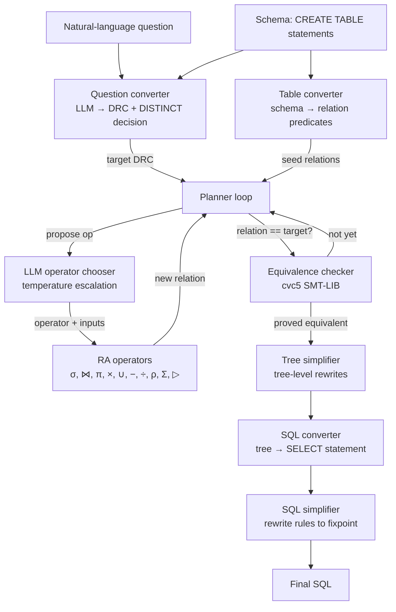

# Text-to-SQL Planner

A natural-language-to-SQL system that produces SQL whose meaning is *formally
verified* against the user's intent — not just plausible-looking SQL stitched
together by a language model.

To see how it works, let's consider a ridiculously simple example. Consider the question "How many employees are at least 30 years old?". Given an appropriate DB schema, we convert this into a [Domain Relational Calculus](https://en.wikipedia.org/wiki/Domain_relational_calculus) (DRC) expression: 

> {COUNT(id) | ∃ id,name,age (id,name,age ∈ Employees ∧ age >= 30)}

Given this _target_ DRC expression and a set of degenerate DRC expressions, one per DB table, we use a symbolic planner to find a tree of [relational algebra](https://en.wikipedia.org/wiki/Relational_algebra) (RA) operators (join, project, select, etc.) that convert the tables into the target relation. Finally we convert this tree of RA operators into a SQL query (and simplify it).

This system acheives near-SOTA performance on the [BIRD-SQL](https://bird-bench.github.io) benchmark suite while having a surprisingly simple architecture.

The pipeline:

1. An LLM converts the question into Domain Relational Calculus (DRC), a
   first-order set-builder language with relations as predicates.
2. A symbolic planner builds the answer as a sequence of relational-algebra
   operators applied to the schema's tables.
3. After every step, an SMT solver (cvc5) is asked to *prove* that the
   relation built so far is logically equivalent to the target DRC. The
   planner iterates until cvc5 returns `unsat` for "the two could differ".
4. The proven operation tree is simplified at the tree level, lowered to
   SQL, and simplified again at the SQL level.

The result is SQL that is provably equivalent to a formal specification of
the question, not just empirically similar.

This repository ships **two top-level packages**:

- [`text_to_sql_planner/`](text_to_sql_planner) — the planner itself.
- [`bird_benchmark/`](bird_benchmark) — a standalone test harness that
  evaluates the planner against the public BIRD benchmark
  (https://bird-bench.github.io). See the [BIRD
  Benchmark](#bird-benchmark) section.

## Goals

- **Correctness first.** Every step is checked by an SMT solver; the SQL we
  emit is the SQL whose DRC the planner *proved* equivalent to the target.
  No "looks right to a benchmark" — `unsat` or nothing.
- **Auditable.** Every artifact is human-readable: the DRC (Lisp + Unicode
  pretty form), the operation tree, the SMT-LIB script, the SQL, and the
  simplified SQL. Verbose mode prints them all.
- **Schema-aware but agnostic.** No fine-tuning, no schema embeddings — only
  the CREATE TABLE statements you provide. Works on schemas the model has
  never seen.
- **Composable extensions.** The core formalism is set-based DRC. Non-set
  features (LIMIT, ORDER BY) are layered on top as explicit
  non-relational wrappers so they don't pollute the core semantics or
  the equivalence check.

## Quick start

```bash
# 1. cvc5 (SMT solver — needed at runtime)
curl -L -o /tmp/cvc5.zip \
  https://github.com/cvc5/cvc5/releases/download/cvc5-1.3.4/cvc5-Linux-x86_64-static.zip
unzip -o /tmp/cvc5.zip -d /tmp/cvc5-extract
sudo install -m755 /tmp/cvc5-extract/cvc5-Linux-*/bin/cvc5 /usr/local/bin/cvc5
cvc5 --version

# 2. Python deps (uv recommended; pip works too)
uv sync     # or: pip install -e ".[dev]"

# 3. AWS credentials with Bedrock access for the Claude model
#    (Anthropic API key is NOT used; we go through Bedrock.)
aws configure          # or env vars / SSO / instance role

# 4. Run an example
uv run python -m text_to_sql_planner \
  -q "Show me the top 5 most-compensated employees" \
  -f example_schema.sql \
  -v
```

## Requirements

- Python 3.11+ (uses `tomllib`, `asyncio.TaskGroup`, etc.)
- `cvc5` on `PATH` (any 1.x release; tested with 1.3.4)
- AWS credentials with `bedrock:InvokeModel` for the configured Claude model

The Python dependencies are pinned in `pyproject.toml`:

| Runtime    | Dev                |
|------------|--------------------|
| `boto3`    | `pytest`           |
| `pydantic` | `pytest-asyncio`   |
|            | `hypothesis`       |

## Usage

### CLI

```bash
uv run python -m text_to_sql_planner [-q QUESTION] [-s SCHEMA | -f SCHEMA_FILE] [...]
```

| Flag             | Purpose                                         |
|------------------|-------------------------------------------------|
| `-q, --question` | The natural-language question (else read stdin) |
| `-s, --schema`   | Inline `CREATE TABLE` statements                |
| `-f, --schema-file` | Path to a file with `CREATE TABLE` statements |
| `-v, --verbose`  | Show DRC, operation tree, SMT scripts           |
| `-o, --output`   | Write Markdown report to file (else stdout)     |
| `--region`       | AWS region (default `us-east-1`)                |
| `--model-id`     | Bedrock model ID                                |
| `--max-iterations` | Planner iteration cap (default 50)            |
| `--max-retries`  | Retries per iteration (default 5)               |
| `--cvc5-path`    | Path to `cvc5` binary (default `cvc5`)          |
| `--cvc5-timeout` | Per-check timeout in seconds (default 30)       |

Exit codes: `0` on success, `1` on any failure.

### Python API

```python
import asyncio
from text_to_sql_planner import run
from text_to_sql_planner.main import TextToSQLSuccess

schema = """\
CREATE TABLE Employees (emp_id INT, name VARCHAR, salary DECIMAL);
"""

async def main():
    result = await run(
        question="Show me the top 5 most-compensated employees",
        schema=schema,
    )
    if isinstance(result, TextToSQLSuccess):
        print(result.sql)
    else:
        print(f"[{result.code.value}] {result.error}")

asyncio.run(main())
```

`run()` accepts an optional `config: PlannerConfig` to tune model, region,
iteration caps, temperature schedule, and cvc5 timeout.

### Examples folder

`examples/example0.py` … `example3.py` are end-to-end runs against the
included `example_schema.sql`. Use them as smoke tests:

```bash
uv run python examples/example3.py
```

### Tests

```bash
uv run pytest tests/ -q          # 747 tests, no external services needed
uv run pytest tests/unit -v      # unit suite only
```

LLM and cvc5 calls are mocked; the suite runs offline.

## Architecture

### High-level pipeline



### What runs where

| Stage              | Module                                                       | What it does                                                              |
|--------------------|--------------------------------------------------------------|---------------------------------------------------------------------------|
| Tokenize / parse   | `parser/lexer.py`, `parser/parser.py`                        | Lisp S-expr → DRC AST. `parse_query` accepts `(limit … (order-by … (drc …)))` wrappers. |
| Print              | `printer/lisp_printer.py`, `printer/pretty_printer.py`       | DRC AST → Lisp form (machine-friendly) and Unicode form (`{x \| ∃y …}`).  |
| Schema → relations | `converter/table_converter.py`                               | Each table becomes a predicate `T(a, b, c)`.                              |
| Question → DRC     | `converter/question_converter.py`, `planner/llm_client.py`   | Bedrock Claude emits Lisp DRC; we re-prompt on parse error.               |
| RA operators       | `operators/{selection,join,projection,cartesian_product,union,difference,division,rename,aggregate}.py` (plus internal anti-join) | Each operator is a pure function `(params, inputs) → DRC`. |
| Planner loop       | `planner/planner.py`                                         | LLM picks next op + inputs; we apply, check equivalence, escalate temp on retries. |
| DRC simplifier     | `drc_simplifier.py`                                          | Per-step DRC rewrites: merge nested quantifiers, eliminate trivial equalities, drop unused binders, etc. |
| Equivalence        | `equivalence/{smt_converter,equivalence_checker}.py`         | DRC → SMT-LIB; parallel cvc5 strategies; first decisive answer wins.       |
| Tree simplifier    | `operation_tree_simplifier.py`                               | Pre-SQL tree rewrites: drop redundant projections, recognise `Join(L, L−R)` as anti-join, recognise three-way differences. |
| SQL emit           | `sql/sql_converter.py`                                       | Operation tree → flat SELECT, with `DISTINCT` / `ORDER BY` / `LIMIT` driven by the extended-DRC wrappers; anti-join → `NOT EXISTS`. |
| SQL simplify       | `sql/simplifier.py`                                          | Rule-based rewrites (unwrap subqueries, inline rebindings, `CROSS JOIN`+`WHERE`→`JOIN ON`, lift single-table predicates from ON to WHERE, …). |

### Relational algebra operators

The planner builds the answer by composing nine relational-algebra
operators that the LLM can select directly, plus an internal anti-join
introduced by the operation-tree simplifier. Each operator is a pure
function `(params, inputs) → DRC` defined in its own module under
`operators/`, with parameter types in `types/operators.py`
(`RAOperatorType` literal: `"selection"`, `"join"`, `"projection"`,
`"cartesian_product"`, `"union"`, `"difference"`, `"division"`,
`"rename"`, `"aggregate"`, `"anti_join"`).

| Symbol | Operator          | Module                            | Inputs | Parameters                       | Output relation                                                                     |
|--------|-------------------|-----------------------------------|--------|----------------------------------|-------------------------------------------------------------------------------------|
| σ      | Selection         | `operators/selection.py`          | 1      | `condition: DRCCondition`        | Same columns; tuples filtered by `condition`.                                       |
| ⋈      | Natural join      | `operators/join.py`               | 2      | `join_columns: list[str]`        | Columns from both inputs with `join_columns` shared once; non-join name collisions on the right are renamed with a `_r2` suffix. |
| π      | Projection        | `operators/projection.py`         | 1      | `columns: list[str]`             | Restricts to the named columns; supports plain columns and aggregates `(AGG col)`.  |
| ×      | Cartesian product | `operators/cartesian_product.py`  | 2      | (none)                           | Concatenates columns; overlapping names get `_1`/`_2` suffixes for self-joins.      |
| ∪      | Union             | `operators/union.py`              | 2      | (none)                           | Combines tuples from same-arity inputs.                                             |
| −      | Set difference    | `operators/difference.py`         | 2      | (none)                           | Tuples in the left input that are not in the right input. Right-side variables are positionally alpha-renamed to the left's column names so the negated subformula speaks about R's tuples. |
| ÷      | Division          | `operators/division.py`           | 2      | (none)                           | Tuples in the left input that are paired with *every* tuple in the right.           |
| ρ      | Rename            | `operators/rename.py`             | 1      | `mapping: dict[str, str]`        | Same rows; renames one or more columns. Used before self-joins so the natural join doesn't collapse on shared names. Capture-avoiding free-variable rename via `operators/_rename.py`. |
| Σ      | Aggregate         | `operators/aggregate.py`          | 1      | `function: COUNT/SUM/AVG/MIN/MAX, column: str` | Promotes the input's single `ColumnVariable` result variable to an `AggregateVariable`. Condition unchanged. Use this when the target's result variable is `(F col)` and you've already built the underlying `{col \| …}` relation — `rename` cannot perform this kind change. |
| ▷      | Anti-join         | (synthesised in `operation_tree_simplifier.py`) | 2 | `join_columns: list[str]`     | Tuples in the left input whose key has no match in the right. Not directly LLM-selectable; introduced by the tree simplifier when it recognises `Join(L, Difference(L, R))` or `Difference(L, Join(L, R))` shapes. Emitted as `NOT EXISTS` in SQL. |

Operators are validated up front: arity checks, column-existence checks,
and (for join/union/difference/division) compatibility between input
schemas. Each operator returns a fresh `DRCExpression` so the
equivalence checker can compare it against the target on the next
iteration.

The dispatcher is `operators.apply_operator(application)`, which routes
an `OperatorApplication` to the right module based on
`OperatorApplication.operator`. The operation-tree simplifier in
`operation_tree_simplifier.py` runs after the planner loop completes
and rewrites the proven tree into a more idiomatic shape (collapsing
redundant projections, recognising anti-join patterns, etc.) before SQL
emission.

There's also a single-relation **DRC simplifier** in `drc_simplifier.py`
that runs after each operator application: it merges nested quantifiers,
eliminates trivial equalities, drops unused binders, and applies
boolean / reflexive-comparison rewrites. This keeps the relations the
equivalence checker sees as small as possible, which improves cvc5's
behaviour.

### Extended DRC

Core DRC is set-based: `{x1, …, xn | φ}`. To represent ordering and
size-bounded queries we layer non-relational wrappers *outside* the set:

```text
QueryExpression ::= LIMIT(N, QueryExpression)
                  | ORDER_BY([(criterion, dir), ...], QueryExpression)
                  | DRCExpression       -- core, set-based
```

In Lisp:

```lisp
(limit 5 (order-by ((salary desc)) (drc (emp_id name salary)
                                        (in (emp_id name salary) Employees))))
```

The wrappers don't change the planner or the SMT layer — equivalence is
checked on the *core* DRC. The wrappers are appended to the outer SELECT
during SQL emission. This keeps the formalism honest: the things SMT can
prove (set-membership) stay in the set-based layer; the things it can't
(row order, row counts) live above it.

### What "verified" means here

For the target DRC `T = {x | φ_T(x)}` and the planner-built relation
`R = {x | φ_R(x)}`, we ask cvc5 to decide:

```text
(set-logic ALL)
(declare-fun ... ; relations as uninterpreted Bool functions
(declare-const ... ; free vars used in φ_R or φ_T)
(assert (not (forall (x1 ... xn) (= φ_R φ_T))))
(check-sat)
```

`unsat` ⇒ no input makes them differ ⇒ the relations are equivalent over
*every* possible interpretation of the schema's predicates, not just one
specific database state. `sat` ⇒ cvc5 found a counter-example. `timeout`
or `unknown` is treated as not-equivalent and the planner keeps searching.

The planner short-circuits an obvious mismatch (different result-variable
arity) without invoking cvc5. The equivalence checker runs multiple
cvc5 strategies in parallel (default profile, `--mbqi`,
`--full-saturate-quant`), and the first decisive answer wins.

### Repository layout

```
text_to_sql_planner/
├── __init__.py
├── main.py                       # run(): full pipeline
├── cli.py                        # argparse + Markdown report
├── drc_simplifier.py             # per-step DRC rewrite passes
├── operation_tree_simplifier.py  # pre-SQL tree rewrites (anti-join recognition, …)
├── types/
│   ├── drc.py                    # core DRC AST + LIMIT/ORDER_BY wrappers
│   ├── operators.py              # RA operator parameter types
│   ├── operation_tree.py         # planner's proven-correct tree shape
│   └── errors.py
├── parser/
│   ├── lexer.py
│   └── parser.py                 # parse() and parse_query()
├── printer/
│   ├── lisp_printer.py           # print_lisp(), print_query_lisp()
│   └── pretty_printer.py         # pretty_print(), pretty_print_query()
├── converter/
│   ├── table_converter.py
│   └── question_converter.py     # LLM-driven, with retry-on-parse-error
├── operators/
│   ├── _rename.py                # shared capture-avoiding free-variable rename
│   ├── selection.py
│   ├── join.py
│   ├── projection.py
│   ├── cartesian_product.py
│   ├── union.py
│   ├── difference.py
│   ├── division.py
│   ├── rename.py
│   ├── aggregate.py              # promote a column result variable to an aggregate (COUNT/SUM/AVG/MIN/MAX)
│   └── exactly_n.py              # canonical "exactly N tuples" pattern emitter
├── equivalence/
│   ├── smt_converter.py          # DRC AST → SMT-LIB text
│   ├── smt_preprocessing.py      # equality elimination, unused-slot pruning
│   └── equivalence_checker.py    # async multi-strategy cvc5 driver
├── planner/
│   ├── llm_client.py             # Bedrock + system prompts
│   └── planner.py                # iteration loop with temperature escalation
└── sql/
    ├── sql_converter.py          # tree → flat SELECT
    └── simplifier.py             # rule-based fixed-point rewriter

bird_benchmark/                   # standalone BIRD benchmark harness (see below)

tests/
├── unit/                         # 747 fast tests, mocks LLM and cvc5
└── ...

examples/                         # end-to-end smoke runs
```

## BIRD benchmark

The `bird_benchmark/` package is a standalone test harness that
evaluates the planner against the public BIRD benchmark
(https://bird-bench.github.io). It lives in a separate top-level
package with its own CLI and a tightly scoped public API surface from
`text_to_sql_planner` so the planner package stays free of test-harness
dependencies.

### What it does

For each `(schema, natural-language question, gold-standard SQL)`
triple in BIRD:

1. Run the planner on the question and schema → generated SQL +
   generated DRC.
2. Convert the gold SQL into DRC via a new SQL→DRC converter (the
   load-bearing new component, see below).
3. Use cvc5 to decide whether the generated DRC and the gold DRC are
   logically equivalent.
4. Record a `Verdict` per Test_Case: `equivalent`, `not_equivalent`,
   `unknown`, `timeout`, `planner_failed`, `converter_failed`,
   `gold_conversion_failure`, `skipped`, or `expected_fail`.
5. Aggregate into a JSON + markdown report.

### Downloading BIRD

The BIRD dataset is distributed by the BIRD authors at
https://bird-bench.github.io. The two ZIPs you'll most often want:

| Split    | Size   | URL                                                                     |
|----------|--------|-------------------------------------------------------------------------|
| Dev      | ~2 GB  | https://bird-bench.oss-cn-beijing.aliyuncs.com/dev.zip                  |
| Train    | ~24 GB | https://bird-bench.oss-cn-beijing.aliyuncs.com/train.zip                |

The dev set is the right starting point — it has 1,534 question-SQL
pairs across 11 databases and is what most published numbers report
on.

The framework ships an `install` subcommand that downloads, extracts,
and normalises a split into the layout the loader expects. One liner:

```bash
uv run python -m bird_benchmark install \
  --bird-root "$HOME/bird" \
  --split dev
```

#### What `--split` means

`--split` names the BIRD partition you want to install. The same value
you install with is the value you later pass to `single` / `suite`.
The installer recognises:

| `--split` | Size   | Contents                                                   |
|-----------|--------|------------------------------------------------------------|
| `dev`     | ~2 GB  | 1,534 question–SQL pairs across 11 databases. The right starting point and what most published numbers report on. |
| `train`   | ~24 GB | The training split. Much larger; takes a long time to run end-to-end. |

The `test` split is held back by the BIRD authors and is not publicly
downloadable — the installer rejects it with a `[install:validate]`
error that points at the two known splits.

Mechanically, the value you pass becomes:

- the directory name created under `--bird-root`
  (`--bird-root ~/bird --split dev` produces `~/bird/dev/`),
- the prefix on the JSON file (`~/bird/dev/dev.json`) and the databases
  directory (`~/bird/dev/dev_databases/`),
- the key the installer uses to look up the official download URL when
  `--url` isn't given.

Most people only ever want `dev`.

That call:

1. Downloads `dev.zip` from the official BIRD endpoint into
   `$HOME/bird/_downloads/dev.zip` (atomic via a `.part` rename).
2. Extracts it into a sibling staging directory.
3. Normalises the layout: BIRD wraps the contents in a release-dated
   inner directory (e.g. `dev_20240627/`) whose name rotates between
   cleanup releases, and sometimes ships the per-database SQLite files
   as a nested `dev_databases.zip`. The installer flattens both shapes
   into the canonical layout.
4. Moves the result atomically into `$HOME/bird/dev`.
5. Verifies the install by streaming every record through
   `BirdLoader`. Records the database / Test_Case / skip counts.

Useful flags:

| Flag             | Purpose                                                                    |
|------------------|----------------------------------------------------------------------------|
| `--url URL`      | Override the download URL (mirror or local file). Only `https://` and `file://` schemes are accepted. |
| `--force`        | Re-download and re-install even when `{bird-root}/{split}` already exists. |
| `--keep-archive` | Keep the downloaded ZIP under `{bird-root}/_downloads/` after extraction so a future `--force` can re-extract without re-downloading. |

Exit codes match the rest of the CLI: `0` on success, `2`
(`EXIT_CONFIG_ERROR`) on any `InstallError` (validate / download /
extract / normalize / verify). The error message includes the failing
stage in `[install:STAGE]` brackets so a wrapper script can grep for
the specific failure mode.

After it returns, the on-disk layout the loader expects is in place:

```
$HOME/bird/
└── dev/
    ├── dev.json
    └── dev_databases/
        └── {db_id}/
            └── {db_id}.sqlite
```

Then point the framework at `$HOME/bird`:

```bash
uv run python -m bird_benchmark single \
  --bird-root "$HOME/bird" \
  --split dev \
  --id dev_42
```

#### Manual install (fallback)

If you'd rather run the steps by hand — for example, to install from a
mirror the `install` subcommand doesn't know about, or because you
already have the ZIP downloaded — the same layout can be produced
manually:

```bash
export BIRD_ROOT="$HOME/bird"
mkdir -p "$BIRD_ROOT"

curl -L -o /tmp/bird-dev.zip \
  https://bird-bench.oss-cn-beijing.aliyuncs.com/dev.zip
unzip -o /tmp/bird-dev.zip -d "$BIRD_ROOT"

# BIRD wraps the contents in a dated directory whose name rotates
# between cleanup releases; rename it to plain ``dev``.
ls "$BIRD_ROOT"
mv "$BIRD_ROOT/dev_20240627" "$BIRD_ROOT/dev"

# Some releases ship the per-database SQLite files as a separate
# nested archive — extract it in place if present.
if [ -f "$BIRD_ROOT/dev/dev_databases.zip" ]; then
  unzip -o "$BIRD_ROOT/dev/dev_databases.zip" -d "$BIRD_ROOT/dev"
fi

ls "$BIRD_ROOT/dev/dev.json"
ls "$BIRD_ROOT/dev/dev_databases" | head
```

If the loader can't find a file it expects, it raises a
`BirdLoadError` whose message names the missing path — the CLI exits
non-zero with that message on stderr, so a misconfigured layout is
diagnosable from the error alone.

A smaller alternative, useful for local iteration, is the [BIRD
Mini-Dev](https://github.com/bird-bench/mini_dev) set: 500 curated
questions also distributed in SQLite. Its layout differs (questions
are in a HuggingFace-style file rather than a single `dev.json`), so
using it with this framework requires either flattening it into the
expected layout or extending the loader; not currently supported
out of the box.

### Three execution modes

Single-test mode for fast iteration on a specific Test_Case:


```bash
uv run python -m bird_benchmark single \
  --bird-root /path/to/bird/download \
  --split dev \
  --id dev_42                      # or --question "exact text"
```

#### Finding Test_Case IDs

Each BIRD record carries a `question_id`; the framework prefixes it
with the split to form the Test_Case_ID, so dev's IDs look like
`dev_0`, `dev_1`, …, `dev_1533`. To browse them, use the `list`
subcommand:

```bash
# Every Test_Case in the dev split (id, db, question), one per line:
uv run python -m bird_benchmark list \
  --bird-root "$HOME/bird" \
  --split dev

# Filter to a single database and grab the first 5 IDs:
uv run python -m bird_benchmark list \
  --bird-root "$HOME/bird" \
  --split dev \
  --db california_schools \
  --ids-only \
  --limit 5

# Find the Test_Cases whose question mentions ``salary``:
uv run python -m bird_benchmark list \
  --bird-root "$HOME/bird" \
  --split dev \
  --contains salary \
  --ids-only
```

Useful combinations:

| Goal                                         | Pipe                                                       |
|----------------------------------------------|------------------------------------------------------------|
| Pick an ID interactively with `fzf`          | `bird-benchmark list ... | fzf | cut -f1`                  |
| Run the first 10 Test_Cases in `single` mode | `bird-benchmark list ... --ids-only --limit 10 | xargs -I{} bird-benchmark single ... --id {}` |
| Seed an Expected_Fail_List                   | `bird-benchmark list ... --ids-only > expected-fail.txt`   |

The default output format is `{test_case_id}\t{db_id}\t{question}` so
it pipes cleanly through `grep`/`awk`/`fzf`. Use `--ids-only` when you
want just the IDs (one per line, no header). Records the loader had
to skip (missing field, missing SQLite) appear on stderr as
`warning: skipping ...` lines and don't pollute the listing on
stdout.

Suite mode for the entire BIRD split, with append-only manifest and
crash-resilient resume:

```bash
uv run python -m bird_benchmark suite \
  --bird-root /path/to/bird/download \
  --split dev \
  --manifest run.jsonl \
  --report-json report.json \
  --report-md   report.md

# Resume from where it left off:
uv run python -m bird_benchmark suite \
  --bird-root /path/to/bird/download \
  --split dev \
  --manifest run.jsonl \
  --resume
```

Sample mode for a deterministic random-N diagnostic run, with both
the cvc5 logical-equivalence rate and the SQLite execution-
equivalence rate reported in the aggregate summary:

```bash
uv run python -m bird_benchmark sample \
  --bird-root /path/to/bird/download \
  --split dev \
  --count 50 \
  --seed 42
```

The seed is required so two runs with the same split + count + seed
produce the same selection — without that you can't tell apart "my
code got better" from "I sampled different cases this time".

Output is written to a directory rather than streamed to a single
file:

- `{output-dir}/{test_case_id}.md` — one transcript per Test_Case
  (BIRD context + planner / cvc5 log + final `Run_Result` JSON).
- `{output-dir}/summary.md` — human-readable aggregate. Lists the
  actual Test_Case_IDs in each bucket, with each ID linked to its
  transcript file (`[dev_42](./dev_42.md)`) so the operator can
  click straight from "12 cases were logically equivalent" to any
  one of them.
- `{output-dir}/summary.json` — machine-readable mirror with the
  same per-bucket ID lists.

Stdout gets only one progress line per case (`[3/50] dev_42
verdict=equivalent exec=match → ./run-07/dev_42.md`) plus a
final headline summarising the rates.

Pass `--output-dir DIR` to choose the location; when omitted, the
sampler auto-allocates `~/runs/run-NN` where `NN` is one greater
than the highest `run-NN` already present in `~/runs`. Two
back-to-back invocations land in distinct directories, so a
``rerun`` doesn't clobber the prior result.

The summary content:

- Logically equivalent (cvc5) rate
- Execution-equivalent (set match) rate — BIRD's official metric
- Multiset match rate — strictly stricter; catches duplicate-count bugs
- The two **disagreement cells**: how many cases had `logical=yes,
  exec=no` and `logical=no, exec=yes`. The latter is the most useful
  diagnostic — it surfaces over-specified BIRD gold queries (extra
  joins on declared-but-not-enforced FKs, redundant filters) where
  both queries return the same rows on BIRD's snapshot
- Per-verdict and per-execution-status breakdowns, each listing the
  actual Test_Case_IDs that fell into the bucket

Common options on both subcommands:

| Flag                    | Purpose                                                                 |
|-------------------------|-------------------------------------------------------------------------|
| `--cvc5-path PATH`      | cvc5 executable (default `cvc5`)                                        |
| `--cvc5-timeout SECONDS`| Per-equivalence-check cvc5 timeout, integer seconds in [1, 3600] (default 30) |
| `--per-test-timeout SECONDS` | Per-Test_Case planner wall-clock budget, integer seconds in [1, 3600] (default 60) |
| `--expected-fail PATH`  | File with one Test_Case_ID per line; listed Test_Cases whose verdict isn't `equivalent` are reported as `expected_fail` |
| `--no-execution-check`  | Skip running the generated and gold SQL against the BIRD SQLite DB. By default both checks run; the report shows `match` / `mismatch` next to the cvc5 verdict so an over-specified gold (logical: not_equivalent, exec: match) is easy to spot |
| `--exec-timeout SECONDS`| Per-query wall-clock budget for the execution check (default 30) |

### Dual equivalence check

Each Test_Case is evaluated two ways and both signals are reported:

1. **Logical equivalence** via cvc5 over the generated and gold DRC.
   This is a proof over *every* possible database state — `unsat` ⇒
   the queries cannot disagree on any input. Strong but strict:
   declared-but-not-enforced foreign-key joins, redundant filters,
   and other "vacuous on this database" patterns get flagged as
   not-equivalent.
2. **Execution equivalence** by running both queries against the
   per-Test_Case SQLite database and comparing result sets. This is
   what BIRD's official leaderboard does. Tracks the same database
   the public leaderboard does, so framework numbers can be
   compared head-to-head.

The two signals are complementary, not redundant. When they agree
you have both a proof and an observation. When they disagree —
typically logical:`not_equivalent`, execution:`match` — the gold
query is over-specified relative to the database snapshot, which is
itself the most useful diagnostic.

The execution result records both **set equality** (BIRD's official
metric) and **multiset equality** (strictly stricter — catches
duplicate-count bugs). Per-query timeout, read-only DB access, and
graceful handling of malformed SQL are built in; the execution
status is one of `match`, `mismatch`, `generated_error`,
`gold_error`, `timeout`, `db_unavailable`, or `skipped`. Use
`--no-execution-check` to skip this entirely (e.g. when the SQLite
files aren't installed).

### The SQL→DRC converter

`bird_benchmark/sql_to_drc/` holds a hand-rolled recursive-descent
SQLite parser + schema-aware translator that produces DRC for the
gold SQL. Out-of-scope SQL features (OUTER JOIN, window functions,
CTEs, set operations, HAVING, recursive queries, etc.) are reported
as structured `ConverterError` values with 1-indexed line/column
positions rather than crashing the run; their Test_Cases get the
`converter_failed` or `gold_conversion_failure` verdict so the suite
keeps going.

The supported SQL subset is enumerated in the parser's module
docstring and includes: `SELECT` with explicit column lists, `FROM`
with one or more tables, `INNER JOIN ... ON`, `WHERE` with
conjunctions and disjunctions of comparisons, `GROUP BY`, `ORDER BY`,
`LIMIT`, scalar aggregates (`COUNT`, `SUM`, `AVG`, `MIN`, `MAX`),
comparison operators (`=`, `!=`, `<`, `>`, `<=`, `>=`), `IN` (with
literal lists or subqueries), `EXISTS`, and simple correlated
subqueries. SQLite-specific quirks are handled: single-quoted
strings, double-quoted identifiers (with the SQLite identifier
fallback), `||` string concatenation, integer-vs-real `/` typing,
and `strftime` calls.

### Exit codes

| Code | Meaning                                                                                        |
|------|------------------------------------------------------------------------------------------------|
| 0    | Success                                                                                         |
| 1    | Single-mode selector failure (zero/multiple/missing/both) (`SingleSelectorError`)               |
| 2    | Configuration error: invalid timeout, missing BIRD files, missing/unreadable Expected_Fail_List, malformed manifest under `--resume` |
| 3    | Report write failure (`SuiteSummary.failed_to_write_report`)                                    |

### Library API

```python
import asyncio
from pathlib import Path
from bird_benchmark import (
    RunOptions, SingleSelector, run_single, run_suite, Verdict,
)

async def main():
    options = RunOptions(
        bird_root=Path("./bird"),
        split="dev",
        manifest_path=Path("./run.jsonl"),
        report_json_path=Path("./report.json"),
        report_md_path=Path("./report.md"),
    )
    summary = await run_suite(options)
    print(f"equivalent: {summary.counts[Verdict.equivalent]}")

asyncio.run(main())
```

### Layout

```
bird_benchmark/
├── __init__.py                   # public surface: run_single, run_suite, types
├── __main__.py                   # python -m bird_benchmark entry point
├── cli.py                        # argparse + dispatch (single / suite / sample / install / list)
├── types.py                      # Verdict, TestCase, RunResult, RunOptions, SuiteSummary
├── loader.py                     # BIRD JSON + per-database SQLite reader
├── installer.py                  # download + extract + normalize for ``install`` subcommand
├── manifest.py                   # append-only JSONL Run_Manifest
├── runner.py                     # run_one / run_single / run_suite
├── report.py                     # JSON and markdown reporters
├── evidence.py                   # planner evidence-keyword forwarding
├── expected_fail.py              # Expected_Fail_List loader + stale-entry detection
└── sql_to_drc/
    ├── __init__.py               # public convert_sql() entrypoint
    ├── ast.py                    # parser AST
    ├── lexer.py                  # SQLite-flavoured lexer
    ├── parser.py                 # recursive-descent SELECT parser
    ├── schema.py                 # CREATE TABLE → column-type lookup
    ├── translator.py             # AST → DRC
    └── pretty_printer.py         # DRC → SQL shim (for the round-trip property)
```

## Limitations

- The planner is bounded by `max_iterations` (default 50) and a per-iteration
  retry cap (default 5). Hard schemas that need long operator chains may
  time out.
- The cvc5 calls are time-boxed (30 s default). For deeply quantified
  expressions cvc5 may return `unknown`, which we treat as
  not-equivalent — the planner keeps trying with higher temperature.
- ORDER BY / LIMIT are only meaningful at the top of the query; the
  formalism doesn't currently support per-subquery ordering inside
  joins.
- Supported aggregates are `COUNT`, `SUM`, `AVG`, `MIN`, `MAX`. There's no
  `HAVING`, `WINDOW`, or `WITH` (CTE) yet.
- The BIRD harness's SQL→DRC converter implements a documented subset
  of SQLite. Out-of-scope gold queries are surfaced as structured
  errors rather than crashing the suite, but they don't contribute to
  the equivalent/not-equivalent tally.

## License

See `pyproject.toml`. Project metadata is `version = 0.1.0`.
